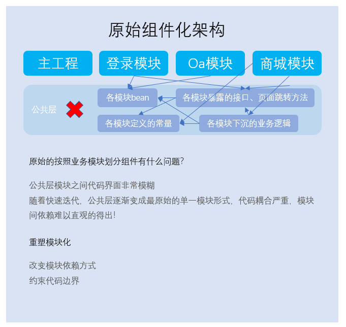
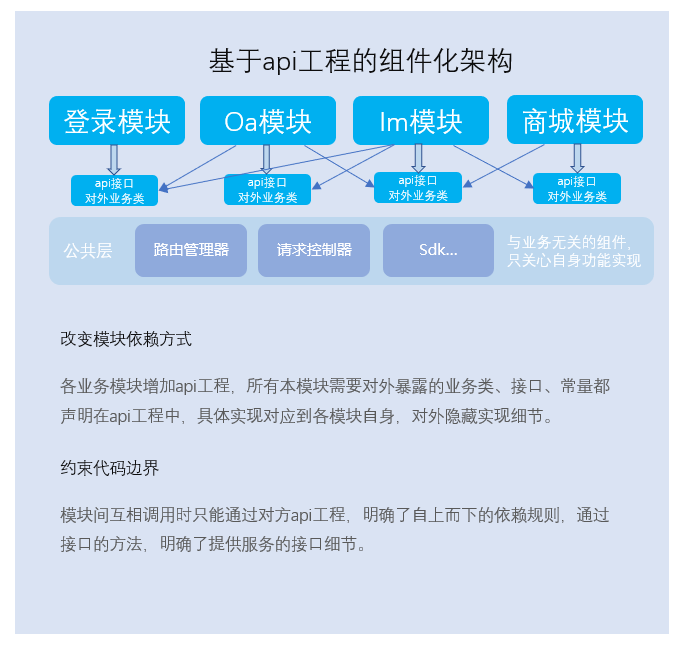

# 组件化整体方案
## 原始方案



## 基于api处理模块间依赖



整体架构图


```
app
- app_* (业务模块文件夹,包含业务模块&业务对外api模块。并且每个业务模块的base层)
    - app_base_*
    - app_base_*_api
    - app_host1_*
    - app_host1_*_api
    - app_host2_*
    - app_host2_*_api

- vendor_* (组件模块)
```

## 模块 source引入与maven aar引入
### 为什么要这样做
开发中我们有俩种方式引入模块代码，适用于不同场景
1. implementation "com.android.tools.build:gradle:3.5.2"   
基于模块代码上传到maven（自建）仓库，由gradle管理文件，通过版本号来更新依赖
这种方式降低了模块间的耦合、加快了项目的编译方式。但是对代码修改不友好。

2. implementation project(":xxx")   
模块代码在本地有一份，可以直接修改，直接编译运行。但是对于非模块维护人员会照成干扰。

因此我们写了一个gradle动态引入脚本，协调这俩种方式，达成一种平衡。

你可以通过一些简单的配置，动态的修改哪些模块时sorce引入，哪些模块时maven aar引入。它时动态的，随时可以切换。


### 如何做
备注：
    1. 原则上业务模块都需要支持动态切换俩种引入方式， 组件模块可以都使用maven aar引入   
    2. 引用其他模块api需要用aar方式（implementation(depsApp.app.app_host1_login_api)）

如何使用，app_login为例 (详见：./setting_template.gradle)
1. 添加模块git到工程 git submodule add ../app_login.git
2. settings.gradle文件moduleInfoList添加对应配置
    ```
    List moduleInfoList = [
        [sourceInclude: Boolean.valueOf(findProperty("app_host1_login.sourceInclude", false)),
                 hasApiModule : true, //为true则会自动依赖app_host1_login_api
                 artifactId   : "app_host1_login",
                 group        : "com.github.hcanyz",
                 path         : "app_login/app_host1_login"],
    ]
    includeDynamic(gradle, settings, moduleInfoList)
    ```
    备注：sourceInclude是否project方式引入，可以在local.properties配置,默认格式app_host1_login.sourceInclude=true   
    artifactId项目id   
    group项目组id   
    path项目在当前工程的相对目录
3. 其他模块具体依赖方法
    例如：app_host1_im模块需要依赖app_host1_login_api模块，在app_host1_im的build.gradle中

    ```
    implementation(depsApp.app.app_host1_login_api) {
        changing = true
    }
    ```
    
    这样就可以根据app_host1_login_api的sourceInclude配置动态引入了
    
    备注：changing = true 这个可以加上，保证aar引入时一定会取服务器最新的aar包
4. 多arr maven上传脚本
    找一个build.gradle文件,加入下面方法，运行
    ```
    task uploadArchivesAll(dependsOn: [':app_base_login:uploadArchives',
                                       ':app_base_login_api:uploadArchives',
                                       ':app_host1_login:uploadArchives',
                                       ':app_host1_login_api:uploadArchives',
                                       ':app_host2_login:uploadArchives',
                                       ':app_host2_login_api:uploadArchives',]) {
        doLast {
            println("success")
        }
    }
    ```

## 各个组件独立初始化
### 为什么要这样做
组件化的目的是尽量减少模块间耦合，减少模块对外暴露的细节。

在app初始化过程中，我们经常会写这样的一些代码：
```kotlin
Application:
fun onCreate(){
    Vendor.init(); //各类sdk

    ModuleA.init()

    ModuleB.init()

    ModuleC.init(()->{
        ModuleD.init()
    })
}
```
这样的做法有一些问题：
1. 对于host模块，它需要知道其他模块init细节
2. 新加一个host模块（比如员工版）都需要写onCreate过程，没有办法让模块自己去初始化

通过编译过程中，修改字节码可以实现动态的添加初始化代码、并且可以定义任务、依赖、的方式协助模块间初始化的需求。

### 如何做
#### 需要初始化的模块
1. build.gradle 添加 implementation deps.vendor.vendor_moduleinit 依赖

2. 建立初始化文件，其中target = module_init_async_arrow_key表示异步执行 = module_init_sync_arrow_key表示同步执行
    ```
    @AutoBowArrow(target = module_init_sync_arrow_key, context = true)
    class ModuleInit(private val application: Application) : IAutoBowArrow {
        override fun shoot() {
            HelloWorld().test(application)
        }
    }
    ```

    注: 有些模块初始化需要依赖host工程的数据，可以放在host工程的vendor_linker项目中统一初始化

#### host 执行初始化
1. 根目录的的build dependencies 添加 classpath deps.build.autoInjectPlugin

2. host的build.gradle 添加 implementation deps.vendor.vendor_moduleinit 依赖

3. 在host的build.gradle  android deps.gradleConfig.simpleAndroid的下面添加includeAutoInject(project),如下
    ```
    android deps.gradleConfig.simpleAndroid
    includeAutoInject(project)
    ```

4. 指定项目Application 为 com.github.hcanyz.moduleinit.ModuleInitApplication
   或者在自己的Application写一份ModuleInitApplication中的代码
       
#### ！启动时间关键指标（我们在初始化的各个节点中加入了日志）
接入ModuleInitApplication后可以在logcat中查看 "StartAnalysis" 数据，观察启动时消耗时间 